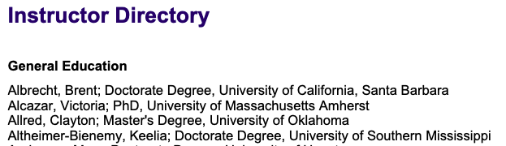
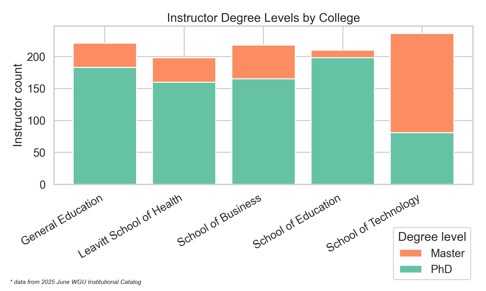

+++
title = "WGU Instructor Atlas Part 1 — Scraping the Catalog"
date = 2025-08-17T09:37:00-04:00   
draft = false
tags = ['WGU-catalog','scraping']
series = ["WGU Instructor Atlas"]
summary = "Parse the June 2025 catalog into a clean CSV with degree normalization and QA."

[cover]
relative = true
hidden = false
hiddenInList = false
hiddenInSingle = false
+++


## Scraping the WGU Catalog
Part 1 of 3: Parse the catalog, clean & normalize degrees. 

<!--more-->

## Introduction  

WGU's Institutional Catalog includes an Instructor Directory with over 1,000 faculty members, listing their degrees and alma maters. While the data appears tabular, small formatting errors and inconsistencies make direct analysis difficult.  

This project converts 18 pages of semi-structured text into a clean, analysis-ready dataset by:  
- Parsing the raw directory  
- Normalizing 80+ degree variations into standardized categories  
- Applying automated validation checks  

The resulting [cleaned dataset](2025_06_instructors.csv) supports analysis of faculty composition and diversity, answering questions such as:
*How many instructors are there by college?* and, *What are the degree types, by college?*   


- **Part 1:** Extract, Clean, Normalize (You are here)
- **Part 2:** [Geotagging alma maters to map instructor origins](../wgu-instructors-2-geo/)  
- **Part 3:** [Building a searchable archive of faculty publications](../wgu-instructors-3-research/)  
___

### Outputs

This walkthrough produces several files you can explore directly:

- [2025_06_instructors.csv](2025_06_instructors.csv) — cleaned instructor directory  
- [instructor_alma_maters.csv](instructor_alma_maters.csv) — alma mater counts by institution  
- [college_degree_barchart.png](images/college_degree_barchart.png) — degree mix by college

## Dataset Description

The WGU Institutional Catalogs are published nearly every month and archived [on their website.](https://www.wgu.edu/about/institutional-catalog.html)  
In the June 2025 issue, the Instructor Directory spans pages 313–331.

  


Each entry follows a basic pattern:
```text
Last, First; Degree, University
```
Entries are grouped under college headers, but the text contains occasional anomalies and formatting errors that require cleaning before analysis.
___

## Process Overview

The data extraction and cleaning process involved three main phases:

1. **Extract** - Copy the 18-page instructor directory from PDF to plain text
2. **Parse & Clean** - Handle formatting inconsistencies and data quality issues  
3. **Normalize & Export** - Standardize degree names and output analysis-ready CSV

## Raw Data Extraction

The instructor directory spans pages 313-331 of the June 2025 catalog. I extracted the entire section as plain text: [instructor_data_raw.txt](instructor_data_raw.txt)

The structure follows a consistent pattern:
- College headers separate each section
- Instructor rows follow the format: `Last, First; Degree, University`
- Page footers contain copyright notices that need filtering

**Example structure:**
```text
General Education
Adams, Sarah; PhD, Stanford University
Baker, Michael; Master's Degree, University of Utah

School of Business  
Clark, Jennifer; MBA, Harvard Business School
```
___

## Parsing & Cleaning

My approach is to write a "base" parser, assume the catalog follows the expected structure and then lean on a few reliable “anchors” to guide the parsing. The script only cares about three things:
	
1.  Headers - the college names we already know (entered manually as a set).
2.  Footers - predictable copyright lines that we skip.
3.	Instructor rows - lines that contain a semicolon.

For instructor rows, the code splits the line into two parts:

```python
name_part, right = s.split(";", 1)
last, first = [x.strip() for x in name_part.split(",", 1)]
degree, university = [x.strip() for x in right.split(",", 1)]
```
That’s the entire core: first grab everything before the semicolon as the name, then break it at the comma into last and first. Everything after the semicolon is split again into degree and university. Because the catalog entries are mostly consistent, this works cleanly without special cases.

The script prints a handful of rows per section in a simple table:
```text
School of Business
name | degree | university
Clark, Jennifer | MBA | Harvard Business School
```


⸻


**Common formatting issues handled:**
- Periods instead of commas: `Clark. Traci; PhD, Stanford`
- Missing separators: `Victoria; PhD University of Michigan` 
- Typos in degrees: `Master's's Degree, East Carolina University`

Regex patterns and fallback logic catch these inconsistencies and flag them for tolerant parsing.

**Validation logic:**


To guarantee no data is lost, the script performs strict line-count validation. Every input line is classified (title, header, footer, blank, instructor, or other).

At the end, the script:
- Reconstructs the total from all categories and compares it to the expected document length (EXPECTED_TOTAL = 1159)
- Confirms that the sum of instructor counts by college matches the total instructor rows parsed
- Exits with an error if any mismatch occurs (useful for CI or reproducibility)

[parse_instructors.py](parse_instructors.py) is the final parser. It includes all the tolerant parsing logic described above and ensures every catalog line is accounted for and every instructor row is captured exactly once.  
___  
## Degree Normalization  

In order to analyze questions like *how many doctorate vs master’s degrees are held in each college*, we needed to first normalize the raw degree names. The catalog data contained more than 80 unique variations such as `"Master's Degree"`, `"Masters Degree"`, `"MA"`, `"M.A."`, and even `"Master's's Degree"` with a double possessive typo.  

I built a [normalization script](normalize_degrees.py) to map these variations to standard forms, then group them into four academic levels.  

**Normalization approach:**  
- **Standardize names:** `"Master's Degree"` → `"Master"`, `"PhD"` → `"PhD"`  
- **Group by level:** all master’s variants → `"master"`, all doctorates → `"doctorate"`  

```python
DEGREE_MAP = {
    "Master's Degree": "Master", "MA": "MA", "MS": "MS", "MBA": "MBA",
    "PhD": "PhD", "EdD": "EdD", "DBA": "DBA", "DNP": "DNP"
    # ... 30+ more mappings
}

def infer_degree_level(standard):
    u = standard.upper()
    if u in DOCTORATE_TITLES:
        return "doctorate"
    if u in MASTER_TITLES:
        return "master"
    # ... etc
```
     
***Results snapshot:***



The cleaned dataset shows clear trends, such as the School of Technology having a noticeably higher share of instructors with master’s degrees compared to other colleges, an insight worth deeper investigation.
___

## Instructor Alma Maters  

The college field required minimal cleaning.  
A full export is available here: [instructor_alma_maters.csv](instructor_alma_maters.csv), which lists each alma mater and the number of instructors from that institution.  

```text
university,count
Western Governors University,70
Capella University,70
Walden University,39
```

---

**Next:** [WGU Instructor Atlas 2 — Geo Mapping](../wgu-instructor-atlas-2-geo-mapping)  
In Part 2, we’ll use geotagging to map instructor alma maters across the globe, showing the diversity of WGU’s faculty origins.